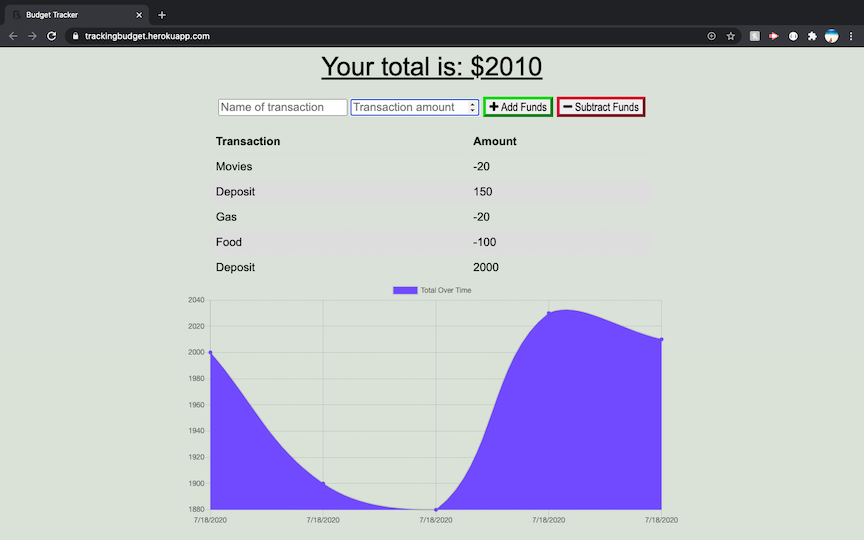

# BudgetTracker
Unit 18 PWA Homework: Online/Offline Budget Trackers

## Description
A full stack budget tracking application that allows a user to add expenses and deposits to their budget with or without a connection. When entering transactions offline, the transaction total will populate when brought back online.

